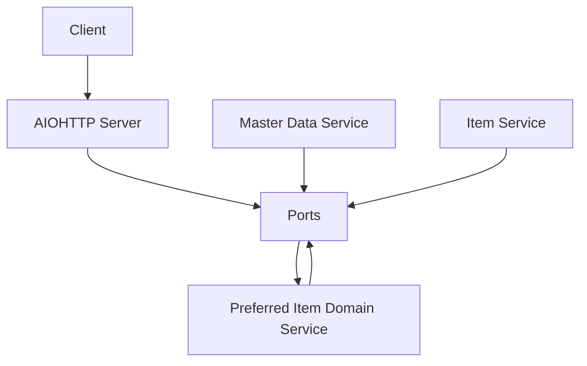

# PreferredItemService
1. [How to run](#how-to-run)
2. [Solution description](#solution-description)
3. [Solution diagram](#solution-diagram)
4. [Rest API schema](#rest-api-schema)
5. [Possible improvements](#possible-improvements)

---
## How to run

Using poetry:

```bash
poetry install
poetry shell
python -m preferred_item_service
```

Running tests:
```bash
pytest
```

Using docker:

```bash
docker build -t preferred_item_service .
docker run -dp 8080:8080 preferred_item_service
```

## Solution description
Current solution describes general approach without using any specific cloud technology.
It could be deployed to EC2 instances or AWS Fargate to increase abstraction level.
Additionally, if this service will stay this small probably it could be beneficial to use as a AWS Lambda.

Architecture of the service tries to use ideas from DDD and Hexagonal architecture by using ports and adapters.
This way we increase the abstraction level from other services and protocols allowing to easily add new protocols(grps/other http frameworks/etc) and other services communication interfaces.

Current plugins includes:
 - http server using aiohttp library
 - master data service and item service adapters with dummy data to simulate valid responses

## Solution Diagram


## Rest API Schema
HTTP POST /
```json
    {
        "bricks":[
            {
                "design_id": int,
                "color_codes": [int]
            }
        ]
    }
```

## Possible improvements
- To reduce amount of time spent fetching information from other services which could use for example http transport caching mechanism could be integrated between services.
- rate limiting and fail recovery can be implemented on api gateway